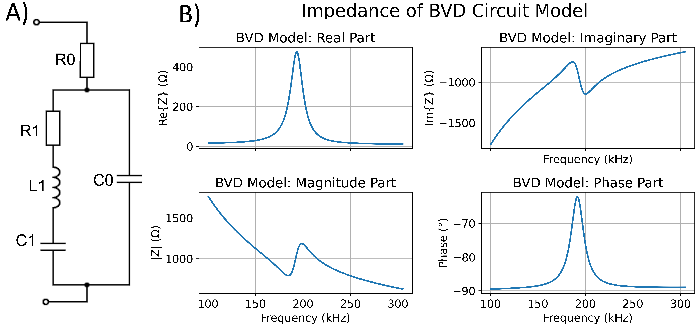
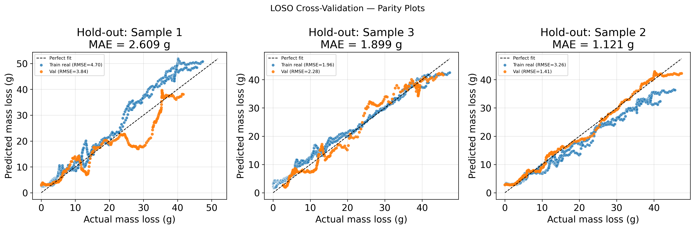
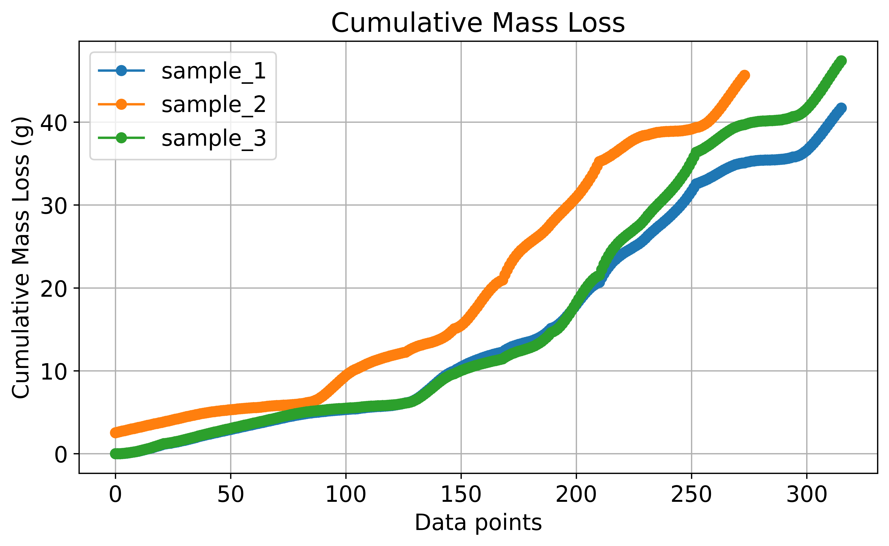

# BVD Features for EMI — Corrosion Detection

Accelerated corrosion experiment conducted at UTTOP France by [Mads Kofod Dahl](https://orcid.org/0009-0006-4330-6730). Three standard steel sensor probes (UTTOP design, no concrete) were corroded under controlled conditions: ~3 % salt-water electrolyte, 7 V applied voltage, 100 mA per sample. Electromechanical impedance (EMI) was measured repeatedly over the test duration.

The primary goal is to use **BVD circuit fitting as a feature-extraction step** — mapping each impedance sweep to five physically interpretable parameters — and then use those features for machine-learning-based corrosion / mass-loss prediction.

---

## Quick-start

### Prerequisites

```bash
pip install numpy pandas scipy matplotlib openpyxl torch scikit-learn
```


### 1. Raw data scaling (always required)

The raw CSV files contain a known firmware scaling offset. Apply the following corrections immediately after loading any file from `Corrosion_Dataset/`:

```python
df['Impedance (ohms)'] = df['Impedance (ohms)'] * 10e4
df['Phase (Radians)'] = df['Phase (Radians)'] * -100
```

### 2. Interactive BVD fitting (GUI)

For manual or exploratory fitting, launch the graphical fitter:

```bash
python bvd_gui_fitter.py
```

See the **[GUI reference](#bvd-gui-fitter)** section below for the required file format.

### 3. Batch BVD fitting

Open [BVD_AllSamples.ipynb](BVD_AllSamples.ipynb). This notebook fits a 1st-order BVD equivalent circuit to the dominant resonant peak (~200 kHz) of the real-part impedance for every measurement session and writes results to `BVD_Fits/fitted_bvd_params.csv`.

**BVD model:**

$$Z(\omega) = R_0 + \frac{1}{\frac{1}{Z_\text{mot}} + \frac{1}{Z_\text{sta}}}, \quad Z_\text{mot} = R_1 + j\omega L_1 + \frac{1}{j\omega C_1}, \quad Z_\text{sta} = \frac{1}{j\omega C_0}$$

| Parameter | Physical interpretation |
|-----------|------------------------|
| `R0` | Series resistance (lead resistance, contact quality) |
| `C0` | Static (clamped) capacitance of the PZT element |
| `R1` | Mechanical damping — increases as the surface roughens |
| `L1` | Acoustic mass — shifts with corrosion-product accumulation |
| `C1` | Mechanical compliance (inverse stiffness) |
| `f_s = 1/(2π√L₁C₁)` | Series resonance — decreases with mass loading (Sauerbrey analogue) |



### 4. Machine learning

Open [ML_Alt_CNN.ipynb](ML_Alt_CNN.ipynb). This notebook trains a 1-D CNN on raw impedance spectra, optionally augmented with fitted BVD parameters, to predict cumulative corrosion mass loss.



---

## Repository layout

```
BVD-Features-for-EMI/
│
├── Corrosion_Dataset/                        # Raw impedance measurements
│   ├── calibrated_mass_loss.csv             # Faraday-law corrected mass loss (ground truth)
│   ├── mass_loss.csv                        # Raw gravimetric mass-loss log
│   ├── uptime.csv                           # Cumulative corrosion uptime log
│   └── YYYY-MM-DD_HH-MM-SS_T.TC_H.HRH/    # Per-session measurement folders
│       ├── currents.txt                     # Applied currents per sample
│       └── sample_N.csv                    # Impedance sweep for sample N
│
├── BVD_Fits/
│   └── fitted_bvd_params.csv               # BVD fit results for all sessions
│
├── BVD_AllSamples.ipynb                    # Batch BVD fitting notebook
├── BVD-Model-Model-on-Data.ipynb           # BVD model exploration and parameter study
├── ML_Alt_CNN.ipynb                        # CNN-based mass-loss prediction notebook
│
├── bvd_gui_fitter.py                       # Interactive GUI for manual BVD fitting
├── bvd_utils.py                            # BVD model, fitting helpers, peak preprocessing
└── ML_Functions.py                         # Shared ML utility functions
```

---

## Dataset overview

### `Corrosion_Dataset/`

Time-series of impedance sweeps acquired throughout the accelerated corrosion test.

- **Samples:** `sample_0`, `sample_5`, `sample_10` — three steel probes, each with a PZT patch bonded to the surface. The number indicates nominal corrosion exposure time in days at the start of the experiment.


- **Session folders:** named `YYYY-MM-DD_HH-MM-SS_T.TC_H.HRH/`, encoding the measurement timestamp, ambient temperature (°C), and relative humidity (%).
- **`calibrated_mass_loss.csv`** — Faraday-law corrected cumulative mass loss per sample; used as the ground-truth target for machine learning.
- **`mass_loss.csv` / `uptime.csv`** — raw gravimetric and uptime logs for reference.



#### Per-sample CSV columns

| Column | Unit | Notes |
|--------|------|-------|
| `Frequency (Hz)` | Hz | Sweep from ~50 kHz to ~300 kHz |
| `Impedance (ohms)` | Ω* | Raw firmware value — multiply by `10e4` |
| `Phase (Radians)` | rad* | Raw firmware value — multiply by `-100` |
| `Temperature (C)` | °C | Recorded at measurement time |
| `Humidity (%)` | % RH | Recorded at measurement time |

*Scaling correction required — see Quick-start step 1.*

### `BVD_Fits/`

`fitted_bvd_params.csv` contains the five fitted BVD parameters (`R0`, `C0`, `R1`, `L1`, `C1`) plus derived quantities (`f_s`, `Q`) for every sample × session combination, produced by [BVD_AllSamples.ipynb](BVD_AllSamples.ipynb).

---

## BVD GUI fitter

`bvd_gui_fitter.py` is a self-contained desktop application for manually fitting the BVD model to any single impedance sweep. It is useful for exploring initial parameter estimates or for data from instruments other than the one used in this dataset.

### Launching

```bash
python bvd_gui_fitter.py
```

### Required file format

The tool accepts **CSV** (`.csv`) or **Excel** (`.xlsx` / `.xls`) files. The file must contain at least three columns with the following exact names (case-insensitive):

| Column name | Description |
|-------------|-------------|
| `Frequency (Hz)` | Measurement frequency in hertz |
| `Impedance (ohms)` | Impedance magnitude in ohms (raw, pre-scaling) |
| `Phase (Radians)` | Phase angle in radians (raw, pre-scaling) |

Additional columns are ignored. A minimal valid CSV looks like:

```
Frequency (Hz),Impedance (ohms),Phase (Radians)
180000,0.00142,0.00095
180300,0.00145,0.00097
...
```

> **Note:** The same `× 10e4` / `× −100` scaling used in the notebooks is applied automatically on load. If your data is already in physical units (Ω and rad), do **not** use this tool without modifying the scaling constants at the top of `bvd_gui_fitter.py`.

### Usage

1. Click **Load File…** and select your CSV or Excel file.
2. Set **Freq min / Freq max** to isolate the resonant peak of interest, then click **Apply**.
3. Adjust the five BVD parameter sliders. The model overlay and RMSD update in real time.
4. To refine precision, edit the **Min** and **Max** fields beside any slider and press **Enter** to rescale that slider's range. Scientific notation is accepted (e.g. `1e-12`).
5. Use **Reset to defaults** to return all parameters to their initial values.

---

## Methodology notes

- **Real-part fitting:** The BVD fit targets `Re(Z)` rather than magnitude or phase, because the real part is more sensitive to damage-driven mechanical changes and is less affected by parasitic lead impedances.
- **Relative features for ML:** BVD parameters should be expressed as `ΔX/X₀` relative to each sample's own baseline (first healthy measurement) before use as ML inputs. This removes sensor-to-sensor fabrication offsets and isolates corrosion-driven drift.
- **Observed BVD trends:** Over the test duration `R1` and `L1` both decrease, consistent with surface roughening (increased mechanical damping) and dissolution of corrosion products reducing effective acoustic mass.
- **Monotonicity constraint:** Cumulative mass loss is physically monotonically non-decreasing. Physics-informed models should enforce this constraint explicitly.
